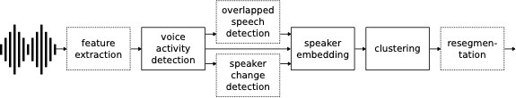

:warning: Checkout [`develop`](https://github.com/pyannote/pyannote-audio/tree/develop) branch to see what is coming in `pyannote.audio` 2.0:

- a much smaller and cleaner codebase
- Python-first API (the *good old* pyannote-audio CLI will still be available, though)
- multi-GPU and TPU training thanks to [pytorch-lightning](https://pytorchlightning.ai/)
- data augmentation with [torch-audiomentations](https://github.com/asteroid-team/torch-audiomentations)
- [huggingface](https://huggingface.co/pyannote) model hosting
- [prodigy](https://prodi.gy) recipes for audio annotations
- online [demo](https://huggingface.co/spaces/pyannote/pretrained-pipelines) based on [streamlit](https://www.streamlit.io)

# Neural speaker diarization with `pyannote-audio`

<p align="center"> 
 <a href="https://www.youtube.com/watch?v=37R_R82lfwA"></a>
</p>

`pyannote.audio` is an open-source toolkit written in Python for speaker diarization. Based on [PyTorch](pytorch.org) machine learning framework, it provides a set of trainable end-to-end neural building blocks that can be combined and jointly optimized to build speaker diarization pipelines:

<p align="center"> 

</p>

`pyannote.audio` also comes with [pretrained models](https://github.com/pyannote/pyannote-audio-hub) covering a wide range of domains for voice activity detection, speaker change detection, overlapped speech detection, and speaker embedding:


[](https://colab.research.google.com/github/pyannote/pyannote-audio/blob/master/notebooks/introduction_to_pyannote_audio_speaker_diarization_toolkit.ipynb)

## Installation

`pyannote.audio` only supports Python 3.7 (or later) on Linux and macOS. It might work on Windows but there is no guarantee that it does, nor any plan to add official support for Windows.

The instructions below assume that `pytorch` has been installed using the instructions from https://pytorch.org.


```bash
$ pip install pyannote.audio==1.1.1
```

## Documentation and tutorials

* Use [pretrained](https://github.com/pyannote/pyannote-audio-hub) models and pipelines
  * [Apply pretrained pipelines on your own data](tutorials/pretrained/pipeline)
  * [Apply pretrained models on your own data](tutorials/pretrained/model)
* Prepare your own data
  * [Annotate your own data semi-automatically with Prodigy](tutorials/prodigy)
  * [Prepare your own dataset for training](tutorials/data_preparation)
* Train models on your own data
  * [Speech activity detection](tutorials/models/speech_activity_detection)
  * [Speaker change detection](tutorials/models/speaker_change_detection)
  * [Overlapped speech detection](tutorials/models/overlap_detection)
  * [Speaker embedding](tutorials/models/speaker_embedding)
  * [Fine-tune pretrained models to your own data](tutorials/finetune)
* Tune pipelines on your own data
  * [Speech activity detection pipeline](tutorials/pipelines/speech_activity_detection)
  * [Speaker diarization pipeline](tutorials/pipelines/speaker_diarization)


Until a proper documentation is released, note that part of the API is described in [this](tutorials/pretrained/model) tutorial.  


## Citation

If you use `pyannote.audio` please use the following citation

```bibtex
@inproceedings{Bredin2020,
  Title = {{pyannote.audio: neural building blocks for speaker diarization}},
  Author = {{Bredin}, Herv{\'e} and {Yin}, Ruiqing and {Coria}, Juan Manuel and {Gelly}, Gregory and {Korshunov}, Pavel and {Lavechin}, Marvin and {Fustes}, Diego and {Titeux}, Hadrien and {Bouaziz}, Wassim and {Gill}, Marie-Philippe},
  Booktitle = {ICASSP 2020, IEEE International Conference on Acoustics, Speech, and Signal Processing},
  Address = {Barcelona, Spain},
  Month = {May},
  Year = {2020},
}
```
