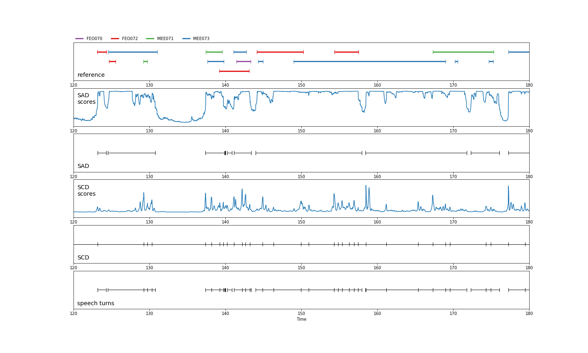

> The MIT License (MIT)
>
> Copyright (c) 2019 CNRS
>
> Permission is hereby granted, free of charge, to any person obtaining a copy
> of this software and associated documentation files (the "Software"), to deal
> in the Software without restriction, including without limitation the rights
> to use, copy, modify, merge, publish, distribute, sublicense, and/or sell
> copies of the Software, and to permit persons to whom the Software is
> furnished to do so, subject to the following conditions:
>
> The above copyright notice and this permission notice shall be included in all
> copies or substantial portions of the Software.
>
> THE SOFTWARE IS PROVIDED "AS IS", WITHOUT WARRANTY OF ANY KIND, EXPRESS OR
> IMPLIED, INCLUDING BUT NOT LIMITED TO THE WARRANTIES OF MERCHANTABILITY,
> FITNESS FOR A PARTICULAR PURPOSE AND NONINFRINGEMENT. IN NO EVENT SHALL THE
> AUTHORS OR COPYRIGHT HOLDERS BE LIABLE FOR ANY CLAIM, DAMAGES OR OTHER
> LIABILITY, WHETHER IN AN ACTION OF CONTRACT, TORT OR OTHERWISE, ARISING FROM,
> OUT OF OR IN CONNECTION WITH THE SOFTWARE OR THE USE OR OTHER DEALINGS IN THE
> SOFTWARE.
>
> AUTHORS
> Hervé Bredin - http://herve.niderb.fr

# Using pre-trained models with `pyannote.audio`

Models pre-trained on AMI are available in their corresponding tutorials sub-directory:
```python
# speech activity detection model trained on AMI training set
SAD_MODEL = ('tutorials/models/speech_activity_detection/train/'
             'AMI.SpeakerDiarization.MixHeadset.train/weights/0280.pt')

# speaker change detection model trained on AMI training set
SCD_MODEL = ('tutorials/models/speaker_change_detection/train/'
             'AMI.SpeakerDiarization.MixHeadset.train/weights/0870.pt')

# speaker embedding model trained on VoxCeleb1
EMB_MODEL = ('tutorials/models/speaker_embedding/train/'               
             'VoxCeleb.SpeakerVerification.VoxCeleb1.train/weights/2000.pt')
```

In this tutorial, you will learn how to use them on your own data.

```python
# one can use their own file like this...
test_file = {'uri': 'filename', 'audio': '/path/to/your/filename.wav'}

# ... or use a file provided by a pyannote.database plugin
# in this example, we are using AMI first test file.
from pyannote.database import get_protocol
from pyannote.database import FileFinder
preprocessors = {'audio': FileFinder()}
protocol = get_protocol('AMI.SpeakerDiarization.MixHeadset',
                        preprocessors=preprocessors)
test_file = next(protocol.test())
```

NOTE: in case of domain mismatch, you might be better off training models on your own data.

## Segmentation into speech turns

```python
# initialize SAD & SCD sequence labeling models
from pyannote.audio.labeling.extraction import SequenceLabeling
sad = SequenceLabeling(model=SAD_MODEL)
scd = SequenceLabeling(model=SCD_MODEL)
```

NOTE: use `SequenceLabeling` option `device=torch.device('cuda')` to run on GPU

### Speech activity detection

```python
# obtain raw SAD scores (as `pyannote.core.SlidingWindowFeature` instance)
sad_scores = sad(test_file)

# binarize raw SAD scores (as `pyannote.core.Timeline` instance)
# NOTE: both onset/offset values were tuned on AMI dataset.
# you might need to use different values for better results.
from pyannote.audio.signal import Binarize
binarize = Binarize(offset=0.94, onset=0.70, log_scale=True)
speech = binarize.apply(sad_scores, dimension=1)

# iterate over speech segments (as `pyannote.core.Segment` instances)
for segment in speech:
    print(segment.start, segment.end)
```
```
3.010 ==>  3.230
3.250 ==>  3.400
4.460 ==>  5.180
9.740 ==> 10.160
16.750 ==> 17.050
24.250 ==> 25.500
```

### Speaker change detection

```python
# obtain raw SCD scores (as `pyannote.core.SlidingWindowFeature` instance)
scd_scores = scd(test_file)

# detect peaks and return speaker homogeneous segments 
# (as `pyannote.core.Annotation` instance)
# NOTE: both alpha/min_duration values were tuned on AMI dataset.
# you might need to use different values for better results.
from pyannote.audio.signal import Peak
peak = Peak(alpha=0.08, min_duration=0.40, log_scale=True)
partition = peak.apply(scd_scores, dimension=1)
for segment in partition:
    print(segment.start, segment.end)
```
```
-0.013 ==>  4.780
 4.780 ==>  9.760
 9.760 ==> 24.130
24.130 ==> 30.140
30.140 ==> 32.260
32.260 ==> 33.770
```

### Final segmentation

```python
# speech turns are simply the intersection of SAD and SCD
speech_turns = partition.crop(speech)
```

### Visualization

```python
# let's visualize SAD and SCD results using pyannote.core visualization API
from matplotlib import pyplot as plt
from pyannote.core import Segment, notebook

# only plot one minute (between t=120s and t=180s)
notebook.crop = Segment(120, 180)

# helper function to make visualization prettier
from pyannote.core import SlidingWindowFeature
plot_ready = lambda scores: SlidingWindowFeature(np.exp(scores.data[:, 1:]), scores.sliding_window)

# create a figure with 6 rows with matplotlib
nrows = 6
fig, ax = plt.subplots(nrows=nrows, ncols=1)
fig.set_figwidth(20)
fig.set_figheight(nrows * 2)

# 1st row: reference annotation
notebook.plot_annotation(test_file['annotation'], ax=ax[0])
ax[0].text(notebook.crop.start + 0.5, 0.1, 'reference', fontsize=14)

# 2nd row: SAD raw scores
notebook.plot_feature(plot_ready(sad_scores), ax=ax[1])
ax[1].text(notebook.crop.start + 0.5, 0.6, 'SAD\nscores', fontsize=14)
ax[1].set_ylim(-0.1, 1.1)

# 3rd row: SAD result
notebook.plot_timeline(speech, ax=ax[2])
ax[2].text(notebook.crop.start + 0.5, 0.1, 'SAD', fontsize=14)

# 4th row: SCD raw scores
notebook.plot_feature(plot_ready(scd_scores), ax=ax[3])
ax[3].text(notebook.crop.start + 0.5, 0.3, 'SCD\nscores', fontsize=14)
ax[3].set_ylim(-0.1, 0.6)

# 5th row: SCD result
notebook.plot_timeline(partition, ax=ax[4])
ax[4].text(notebook.crop.start + 0.5, 0.1, 'SCD', fontsize=14)

# 6th row: combination of SAD and SCD
notebook.plot_timeline(speech_turns, ax=ax[5])
ax[5].text(notebook.crop.start + 0.5, 0.1, 'speech turns', fontsize=14)
```



### Speech turn embedding

```python
# initialize sequence embedding model
from pyannote.audio.embedding.extraction import SequenceEmbedding
emb = SequenceEmbedding(model=EMB_MODEL, duration=1., step=0.5)

# obtain raw embeddings (as `pyannote.core.SlidingWindowFeature` instance)
# embeddings are extracted every 500ms on 1s-long windows
embeddings = emb(test_file)
```

NOTE: use `SequenceEmbedding` option `device=torch.device('cuda')` to run on GPU

```python
# for the purpose of this tutorial, we only work of long (> 2s) speech turns
from pyannote.core import Timeline
long_turns = Timeline(segments=[s for s in speech_turns if s.duration > 2.])
```

Extracting embedding for a given speech turn is as easy as `embedding.crop(segment)`:

```python
X, Y = [], []
for segment in long_turns:
    # "strict" only keeps embedding strictly included in segment
    x = embeddings.crop(segment, mode='strict')
    # average speech turn embedding
    X.append(np.mean(x, axis=0))

    # keep track of speaker label (for later scatter plot)
    y = test_file['annotation'].argmax(segment)
    Y.append(y)

X = np.vstack(X)
_, y_true = np.unique(Y, return_inverse=True)
```

We can use *tSNE* to visualize (and later cluster, maybe?) embeddings.

```python
# apply tSNE on embeddings
from sklearn.manifold import TSNE
tsne = TSNE(n_components=2, metric="cosine")
X_2d = tsne.fit_transform(X)

# plot 
fig, ax = plt.subplots()
fig.set_figheight(5)
fig.set_figwidth(5)
plt.scatter(*X_2d.T, c=y_true)
```


That's all folks!
