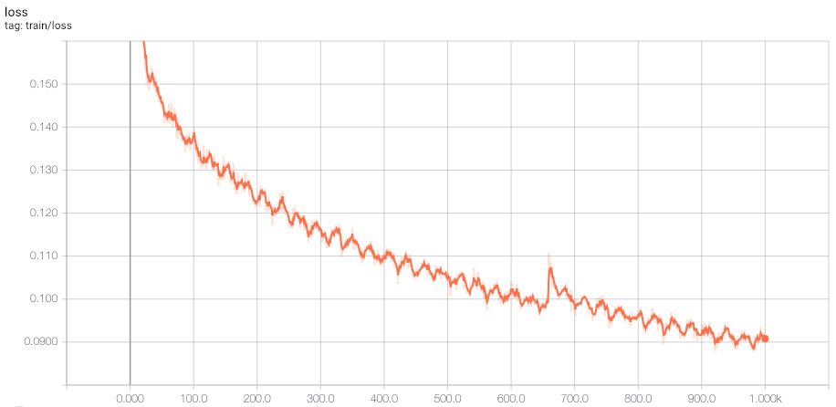
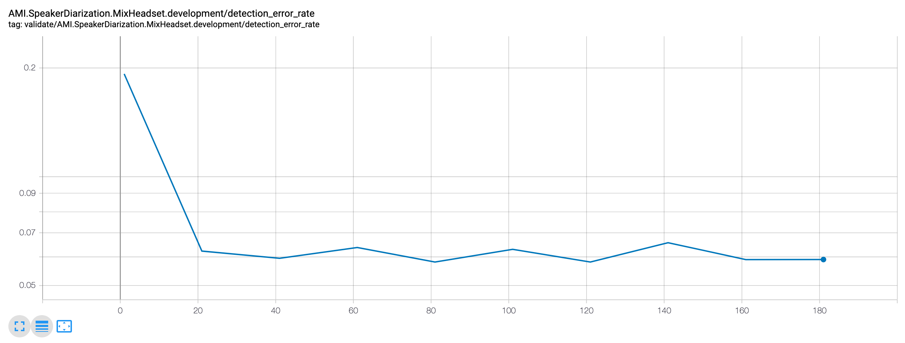

> The MIT License (MIT)
>
> Copyright (c) 2017-2020 CNRS
>
> Permission is hereby granted, free of charge, to any person obtaining a copy
> of this software and associated documentation files (the "Software"), to deal
> in the Software without restriction, including without limitation the rights
> to use, copy, modify, merge, publish, distribute, sublicense, and/or sell
> copies of the Software, and to permit persons to whom the Software is
> furnished to do so, subject to the following conditions:
>
> The above copyright notice and this permission notice shall be included in all
> copies or substantial portions of the Software.
>
> THE SOFTWARE IS PROVIDED "AS IS", WITHOUT WARRANTY OF ANY KIND, EXPRESS OR
> IMPLIED, INCLUDING BUT NOT LIMITED TO THE WARRANTIES OF MERCHANTABILITY,
> FITNESS FOR A PARTICULAR PURPOSE AND NONINFRINGEMENT. IN NO EVENT SHALL THE
> AUTHORS OR COPYRIGHT HOLDERS BE LIABLE FOR ANY CLAIM, DAMAGES OR OTHER
> LIABILITY, WHETHER IN AN ACTION OF CONTRACT, TORT OR OTHERWISE, ARISING FROM,
> OUT OF OR IN CONNECTION WITH THE SOFTWARE OR THE USE OR OTHER DEALINGS IN THE
> SOFTWARE.
>
> AUTHOR
> Hervé Bredin - http://herve.niderb.fr

# End-to-end speech activity detection with `pyannote.audio`

This tutorial assumes that you have already followed the [data preparation](../../data_preparation) tutorial, and teaches how to train, validate, and apply a speech activity detection neural network on the [AMI](http://groups.inf.ed.ac.uk/ami/corpus) dataset using `pyannote-audio` command line tool. In particular, this should reproduce the result reported in second line of Table 1 of [this introductory paper](https://arxiv.org/abs/1911.01255).

## Table of contents
- [Citation](#citation)
- [Configuration](#configuration)
- [Training](#training)
- [Validation](#validation)
- [Application](#application)
- [More options](#more-options)

## Citation
([↑up to table of contents](#table-of-contents))

If you use `pyannote-audio` for speech activity detection, please cite the following papers:

```bibtex
@inproceedings{Bredin2020,
  Title = {{pyannote.audio: neural building blocks for speaker diarization}},
  Author = {{Bredin}, Herv{\'e} and {Yin}, Ruiqing and {Coria}, Juan Manuel and {Gelly}, Gregory and {Korshunov}, Pavel and {Lavechin}, Marvin and {Fustes}, Diego and {Titeux}, Hadrien and {Bouaziz}, Wassim and {Gill}, Marie-Philippe},
  Booktitle = {ICASSP 2020, IEEE International Conference on Acoustics, Speech, and Signal Processing},
  Address = {Barcelona, Spain},
  Month = {May},
  Year = {2020},
}
```

```bibtex
@inproceedings{Lavechin2020,
  Title = {{End-to-end Domain-Adversarial Voice Activity Detection}},
  Author = {{Lavechin}, Marvin and {Gill}, Marie-Philippe and {Bousbib}, Ruben and {Bredin}, Herv{\'e} and {Garcia-Perera}, Leibny Paola},
  Booktitle = {ICASSP 2020, IEEE International Conference on Acoustics, Speech, and Signal Processing},
  Address = {Barcelona, Spain},
  Month = {May},
  Year = {2020},
}
```


## Configuration
([↑up to table of contents](#table-of-contents))

To ensure reproducibility, `pyannote-audio` relies on a configuration file defining the experimental setup:

```bash
$ export EXP_DIR=tutorials/models/speech_activity_detection
$ cat ${EXP_DIR}/config.yml
```
```yaml
# A speech activity detection model is trained.
# Here, training relies on 2s-long audio chunks,
# batches of 64 audio chunks, and saves model to
# disk every one (1) day worth of audio.
task:
   name: SpeechActivityDetection
   params:
      duration: 2.0
      batch_size: 64
      per_epoch: 1

# Data augmentation is applied during training.
# Here, it consists in additive noise from the
# MUSAN database, with random signal-to-noise
# ratio between 5 and 20 dB
data_augmentation:
   name: AddNoise
   params:
      snr_min: 5
      snr_max: 20
      collection: MUSAN.Collection.BackgroundNoise

# Since we are training an end-to-end model, the
# feature extraction step simply returns the raw
# waveform.
feature_extraction:
   name: RawAudio
   params:
      sample_rate: 16000

# We use the PyanNet architecture in Figure 2 of
# pyannote.audio introductory paper. More details
# about the architecture and its parameters can be
# found directly in PyanNet docstring.
architecture:
   name: pyannote.audio.models.PyanNet
   params:
      rnn:
         unit: LSTM
         hidden_size: 128
         num_layers: 2
         bidirectional: True
      ff:
         hidden_size: [128, 128]

# We use a constant learning rate of 1e-2
scheduler:
   name: ConstantScheduler
   params:
      learning_rate: 0.01
```

## Training
([↑up to table of contents](#table-of-contents))

The following command will train the network using the training subset of AMI database for 200 epochs:

```bash
$ pyannote-audio sad train --subset=train --to=200 --parallel=4 ${EXP_DIR} AMI.SpeakerDiarization.MixHeadset
```

This will create a bunch of files in `TRN_DIR` (defined below). One can also follow along the training process using [tensorboard](https://github.com/tensorflow/tensorboard):
```bash
$ tensorboard --logdir=${EXP_DIR}
```




## Validation
([↑up to table of contents](#table-of-contents))

To get a quick idea of how the network is doing on the development set, one can use the `validate` mode.

```bash
$ export TRN_DIR=${EXP_DIR}/train/AMI.SpeakerDiarization.MixHeadset.train
$ pyannote-audio sad validate --subset=development --from=10 --to=200 --every=10 ${TRN_DIR} AMI.SpeakerDiarization.MixHeadset
```
It can be run while the model is still training and evaluates the model every 10 epochs. This will create a bunch of files in `VAL_DIR` (defined below). 

In practice, it tunes a simple speech activity detection pipeline every 10 epochs and stores the best hyper-parameter configuration on disk (i.e. the one that maximizes detection f-score):

```bash
$ export VAL_DIR=${TRN_DIR}/validate_detection_fscore/AMI.SpeakerDiarization.MixHeadset.development
$ cat ${VAL_DIR}/params.yml
```
```yaml
detection_fscore: 0.9713032559713921
epoch: 140
params:
  min_duration_off: 0.1
  min_duration_on: 0.1
  offset: 0.48012924491559134
  onset: 0.48012924491559134
  pad_offset: 0.0
  pad_onset: 0.0
```

See `pyannote.audio.pipeline.speech_activity_detection.SpeechActivityDetection` for details on the role of each parameter.

Like for training, one can also use [tensorboard](https://github.com/tensorflow/tensorboard) to follow the validation process:

```bash
$ tensorboard --logdir=${EXP_DIR}
```




## Application
([↑up to table of contents](#table-of-contents))

Now that we know how the model is doing, we can apply it on test files of the AMI database: 

```bash
$ pyannote-audio sad apply --subset=test ${VAL_DIR} AMI.SpeakerDiarization.MixHeadset 
```

Raw model output and speech activity detection results will be dumped into the following directory: `${VAL_DIR}/apply/{BEST_EPOCH}`.

## More options

For more options, see:

```bash
$ pyannote-audio --help
```

That's all folks!
