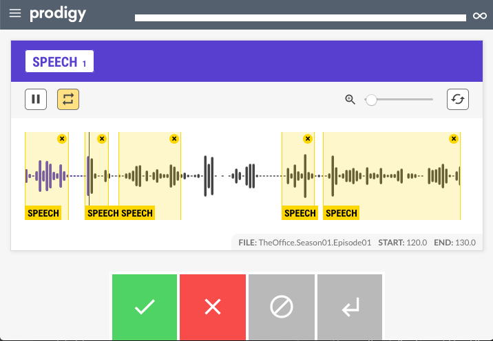
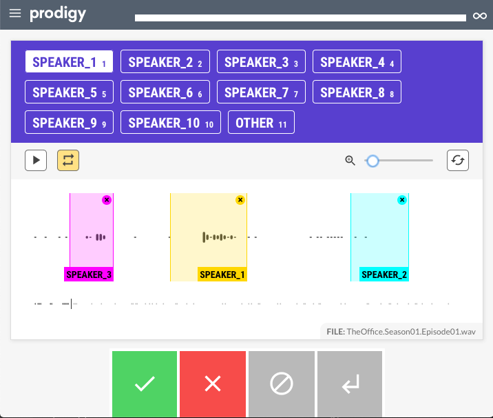
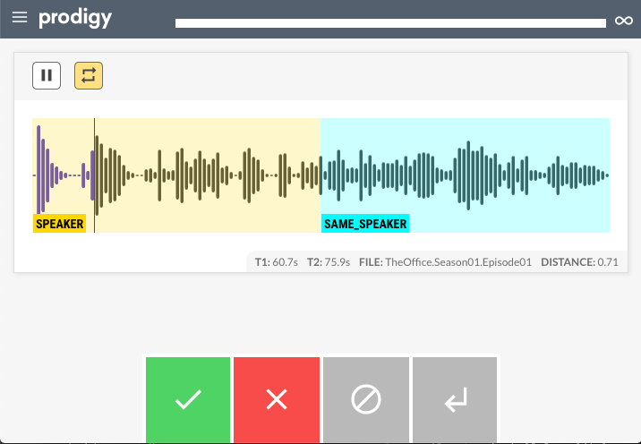

> The MIT License (MIT)
>
> Copyright (c) 2020 CNRS
>
> Permission is hereby granted, free of charge, to any person obtaining a copy
> of this software and associated documentation files (the "Software"), to deal
> in the Software without restriction, including without limitation the rights
> to use, copy, modify, merge, publish, distribute, sublicense, and/or sell
> copies of the Software, and to permit persons to whom the Software is
> furnished to do so, subject to the following conditions:
>
> The above copyright notice and this permission notice shall be included in all
> copies or substantial portions of the Software.
>
> THE SOFTWARE IS PROVIDED "AS IS", WITHOUT WARRANTY OF ANY KIND, EXPRESS OR
> IMPLIED, INCLUDING BUT NOT LIMITED TO THE WARRANTIES OF MERCHANTABILITY,
> FITNESS FOR A PARTICULAR PURPOSE AND NONINFRINGEMENT. IN NO EVENT SHALL THE
> AUTHORS OR COPYRIGHT HOLDERS BE LIABLE FOR ANY CLAIM, DAMAGES OR OTHER
> LIABILITY, WHETHER IN AN ACTION OF CONTRACT, TORT OR OTHERWISE, ARISING FROM,
> OUT OF OR IN CONNECTION WITH THE SOFTWARE OR THE USE OR OTHER DEALINGS IN THE
> SOFTWARE.
>
> AUTHOR
> Hervé Bredin - http://herve.niderb.fr

# Annotate your own data semi-automatically with Prodigy

Manually annotating data for training is time consuming.  
Luckily, `pyannote.audio` comes with a bunch of [Prodigy](https://prodi.gy) recipes that should speed things up a bit. 

## Speech activity detection with `pyannote.sad.manual`

The `pyannote.sad.manual` recipe will stream in `.wav` files in chunks and tag the detected speech regions as `SPEECH`.  
You can then adjust the regions manually if needed.

## Speaker diarization with `pyannote.dia.manual`

The `pyannote.dia.manual` recipe will stream in `.wav` files and tag each speaker with its own `SPEAKER_X` tag.  
You can then adjust and re-assign the regions manually if needed.

Note that, if you ran the `pyannote.sad.manual` recipe first, the manually adjusted speech regions boundaries will be used so that you can focus on the tagging part.

## Speaker comparison with `pyannote.dia.binary`

While the `pyannote.dia.manual` recipe might be useful is some cases, it might be impractical to use for longer files with lots of speakers. 

The `pyannote.dia.binary` recipe will play two short excerpts of the manually adjusted speech regions from the `pyannote.sad.manual` recipe and ask you whether they were uttered by the same speaker. 

Your answers will then be used to improve the initial suggestion of `pyannote.dia.manual` recipe.  
In practice, they will serve as "cannot link" or "must link" constraints in the internal hierarchical agglomerative clustering part of the speaker diarization pipeline.
 
## Disclaimer

If you are using this feature, please consider supporting the development of `pyannote.audio` (either through [`Github Sponsors`](https://github.com/sponsors/hbredin)  or [via other ways](mailto:bredin@limsi.fr)) as I am not affiliated with [Explosion](https://explosion.ai) and will not get any money from your purchase of a [Prodigy](https//prodi.gy) license (nor be able to hire any academic researcher to further work on this).
