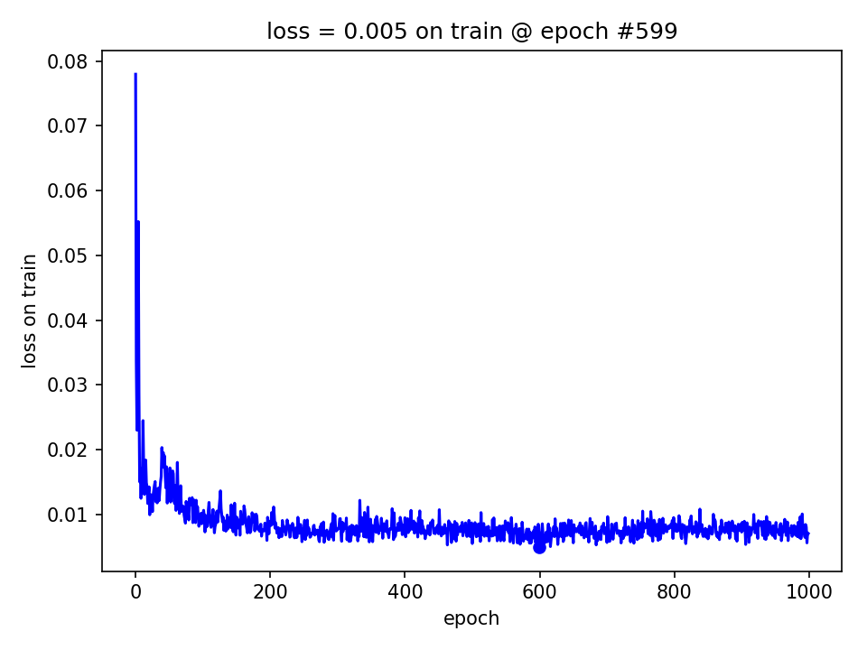

> The MIT License (MIT)
>
> Copyright (c) 2017 CNRS
>
> Permission is hereby granted, free of charge, to any person obtaining a copy
> of this software and associated documentation files (the "Software"), to deal
> in the Software without restriction, including without limitation the rights
> to use, copy, modify, merge, publish, distribute, sublicense, and/or sell
> copies of the Software, and to permit persons to whom the Software is
> furnished to do so, subject to the following conditions:
>
> The above copyright notice and this permission notice shall be included in all
> copies or substantial portions of the Software.
>
> THE SOFTWARE IS PROVIDED "AS IS", WITHOUT WARRANTY OF ANY KIND, EXPRESS OR
> IMPLIED, INCLUDING BUT NOT LIMITED TO THE WARRANTIES OF MERCHANTABILITY,
> FITNESS FOR A PARTICULAR PURPOSE AND NONINFRINGEMENT. IN NO EVENT SHALL THE
> AUTHORS OR COPYRIGHT HOLDERS BE LIABLE FOR ANY CLAIM, DAMAGES OR OTHER
> LIABILITY, WHETHER IN AN ACTION OF CONTRACT, TORT OR OTHERWISE, ARISING FROM,
> OUT OF OR IN CONNECTION WITH THE SOFTWARE OR THE USE OR OTHER DEALINGS IN THE
> SOFTWARE.
>
> AUTHOR  
> Hervé Bredin - http://herve.niderb.fr

# Neural speech turn embedding with `pyannote.audio`

In this tutorial, you will learn how to train a [_TristouNet_](http://arxiv.org/abs/1609.04301) speech turn embedding using `pyannote-speaker-embedding` command line tool.

## Table of contents
- [Citation](#citation)
- [Installation](#installation)
- [Experimental setup](#experimental-setup)
  - [ETAPE database](#etape-database)
  - [Data preparation](#data-preparation)
  - [Training](#training)
  - [Validation](#validation)
  - [Extraction](#extraction)
- [Pretrained model](#pretrained-model)

## Citation
([↑up to table of contents](#table-of-contents))

If you use `pyannote-audio` for speaker (or audio) neural embedding, please cite the following paper:

```bibtex
@inproceedings{Bredin2017,
    author = {Herv\'{e} Bredin},
    title = {{TristouNet: Triplet Loss for Speaker Turn Embedding}},
    booktitle = {42nd IEEE International Conference on Acoustics, Speech and Signal Processing, ICASSP 2017},
    year = {2017},
    url = {http://arxiv.org/abs/1609.04301},
}
```

## Installation
([↑up to table of contents](#table-of-contents))

```bash
$ conda create --name py35-pyannote-audio python=3.5 anaconda
$ source activate py35-pyannote-audio
$ conda install -c conda-forge yaafe
$ pip install "pyannote.audio==0.3"
$ pip install pyannote.db.etape
```

## Experimental setup
([↑up to table of contents](#table-of-contents))

### ETAPE database
([↑up to table of contents](#table-of-contents))

This tutorial relies on the [ETAPE database](http://islrn.org/resources/425-777-374-455-4/). We first need to tell `pyannote` where the audio files are located:

```bash
$ cat ~/.pyannote/db.yml
Etape: /path/to/Etape/corpus/{uri}.wav
```

If you want to train the network using a different database, you might need to create your own [`pyannote.database`](http://github.com/pyannote/pyannote-database) plugin.
See [github.com/pyannote/pyannote-db-template](https://github.com/pyannote/pyannote-db-template) for details on how to do so.

### Data preparation
([↑up to table of contents](#table-of-contents))

`pyannote-speaker-embedding` relies on a configuration file defining the feature extraction step:

```bash
$ export ROOT_DIR=tutorials/speaker-embedding
$ cat $ROOT_DIR/config.yml
feature_extraction:
   name: YaafeMFCC
   params:
      duration: 0.032
      step: 0.020
      coefs: 11
      D: True
      DD: True
      e: False
      De: True
      DDe: True
```

The following command should provide you with some details on those parameters:

```python
$ ipython
>>> from pyannote.audio.features import YaafeMFCC
>>> help(YaafeMFCC)
```

Running the following command will then prepare the data later used for training.

```bash
$ pyannote-speaker-embedding data --duration=2 --step=0.5 $ROOT_DIR Etape.SpeakerDiarization.TV
Training set: 28it [03:11,  3.26s/it]
Development set: 9it [00:51,  4.33s/it]
Test set: 9it [00:50,  4.61s/it]
```

Practically, this will generate a large collection of speaker-labeled 2s segments (with a 500ms step) stored in HDF5 file format:

```bash
$ ls $ROOT_DIR/2+0.5/sequences
ls $ROOT_DIR/2+0.5/sequences
Etape.SpeakerDiarization.TV.development.h5  Etape.SpeakerDiarization.TV.test.h5  Etape.SpeakerDiarization.TV.train.h5
```

### Training
([↑up to table of contents](#table-of-contents))

`pyannote-speaker-embedding` then relies on a second configuration file defining the neural network architecture and the training setup  (loss, batch size, number of sequences per speaker, etc...):

```
$ export EXPERIMENT_DIR=$ROOT_DIR/2+0.5/TristouNet
$ cat $EXPERIMENT_DIR/config.yml
architecture:
   name: TristouNet
   params:
     rnn: LSTM
     recurrent: [16]
     mlp: [16, 16]
     bidirectional: concat

approach:
   name: TripletLoss
   params:
     metric: euclidean
     margin: 0.1
     clamp: positive
     per_batch: 12
     per_fold: 20
     per_label: 3
     gradient_factor: 10000
     batch_size: 32
```

The following commands should provide you with some details on those parameters:

```python
$ ipython
>>> from pyannote.audio.embedding.models import TristouNet
>>> help(TristouNet)
>>> from pyannote.audio.embedding.approach import TripletLoss
>>> help(TripletLoss)
```

Running the following command will actually train the network:

```bash
$ pyannote-speaker-embedding train --subset=train $EXPERIMENT_DIR Etape.SpeakerDiarization.TV
Epoch 1/1000
1/1 [==============================] - 439s - loss: 0.0781
Epoch 2/1000
1/1 [==============================] - 33s - loss: 0.0345
...
Epoch 998/1000
1/1 [==============================] - 32s - loss: 0.0056
Epoch 999/1000
1/1 [==============================] - 32s - loss: 0.0072
Epoch 1000/1000
1/1 [==============================] - 30s - loss: 0.0071
```

Practically, this will generate a bunch of files in the `TRAIN_DIR` directory:

```bash
$ export TRAIN_DIR=$EXPERIMENT_DIR/train/Etape.SpeakerDiarization.TV.train
$ ls $TRAIN_DIR
loss.train.eps
loss.train.png
loss.train.txt
weights
```

`$TRAIN_DIR/loss.train.txt` contains the value of the (hopefully decreasing) loss after each epoch:

```bash
$ cat $TRAIN_DIR/loss.train.txt
0 2017-07-05T14:16:29.608407 0.078
1 2017-07-05T14:17:03.749268 0.034
2 2017-07-05T14:17:33.785134 0.023
...
997 2017-07-05T23:07:05.195969 0.006
998 2017-07-05T23:07:37.625752 0.007
999 2017-07-05T23:08:08.165979 0.007
```



The trained neural network is dumped into the `$TRAIN_DIR/weights` subdirectory after each epoch:

```bash
$ ls $TRAIN_DIR/weights
0000.h5  0001.h5  0002.h5  [...]  0997.h5  0998.h5  0999.h5
```

### Validation
([↑up to table of contents](#table-of-contents))

Now that the network is training, we can run the following command in parallel to perform validation (here, on the development set).
It will continuously watch the `$TRAIN_DIR/weights` repository for completed epochs, perform a "same/different" validation experiment after each epoch, and report the equal error rate (EER):

```
$ pyannote-speaker-embedding validate --subset=development $TRAIN_DIR Etape.SpeakerDiarization.TV
Best EER = 11.49% @ epoch #986 :: EER = 12.41% @ epoch #388 :: 389epoch [8:52:25, 27.47s/epoch]
```

Practically, this will generate a bunch of files in the `VALIDATION_DIR` directory:

```
$ export VALIDATION_DIR=$TRAIN_DIR/validate/Etape.SpeakerDiarization.TV
$ ls $VALIDATION_DIR
development.eer.eps
development.eer.png
development.eer.txt
```

`$VALIDATION_DIR/development.eer.txt` contains the value of equal error rate after each epoch:

```bash
$ cat $VALIDATION_DIR/development.eer.txt
0000 0.262921
0001 0.253302
0002 0.257871
...
0997 0.115512
0998 0.117362
0999 0.115682
```

File `$VALIDATION_DIR/development.eer.txt` can then be used to select the best epoch.


### Extraction
([↑up to table of contents](#table-of-contents))

Once the model is trained and validated, one can use the following command to extract embeddings using the best epoch:

```bash
$ export $OUTPUT_DIR=/path/where/to/export/embeddings
$ pyannote-speaker-embedding apply --step=2.0 $VALIDATION_DIR/development.eer.txt Etape.SpeakerDiarization.TV $OUTPUT_DIR
Development set: 9it [00:30,  2.90s/it]
Test set: 9it [00:31,  3.07s/it]
Training set: 28it [01:47,  2.27s/it]
```

These embeddings can then be used in the following way:

```python
$ ipython
>>> # get first test file
>>> from pyannote.database import get_protocol
>>> protocol = get_protocol('Etape.SpeakerDiarization.TV')
>>> first_test_file = next(protocol.test())

>>> # load previously computed embedding
>>> from pyannote.audio.features import Precomputed
>>> precomputed = Precomputed('/path/where/to/export/embeddings')
>>> embedding = precomputed(first_test_file)

>>> # print embedding of first five positions of the 2s sliding window
>>> for i, (X, window) in enumerate(embedding.iterfeatures(window=True)):
...     print(window)
...     print(X)
...     print()
...     if i > 4: break
...
[ 00:00:00.000 -->  00:00:02.000]
[ 0.13484031  0.15702391 -0.31218842 -0.4281964  -0.07925474 -0.08565747
 -0.16715825  0.34894145 -0.3240602   0.39062694  0.27343082 -0.21899402
  0.12243154 -0.02151109  0.01033155 -0.34225875]

[ 00:00:02.000 -->  00:00:04.000]
[ 0.20317045 -0.04141215  0.09865901 -0.05165086  0.22332488  0.33440286
 -0.16102979  0.2737613  -0.24239188  0.22887142  0.5028137  -0.34624743
 -0.22420762 -0.03909453  0.36982456 -0.09807042]

[ 00:00:04.000 -->  00:00:06.000]
[ 0.26162925  0.11913186 -0.13440835 -0.26595095 -0.05303163  0.18132406
 -0.03330285  0.35068893 -0.26545042  0.29646441  0.46176749 -0.12204482
  0.02964206  0.07929333  0.45056149 -0.26856777]

[ 00:00:06.000 -->  00:00:08.000]
[-0.14165302  0.12688759 -0.54229081 -0.21842276 -0.00694817  0.17356414
  0.21332134  0.1061216  -0.05795221  0.13348618  0.61137712 -0.16415738
  0.05128939  0.06245145  0.25262761 -0.20699632]

[ 00:00:08.000 -->  00:00:10.000]
[ 0.11707274  0.16470636 -0.3472997  -0.17348388  0.0177735  -0.47984987
  0.08130848 -0.22584145  0.18329756  0.13363509  0.41501275 -0.08269798
 -0.49005994 -0.17172098  0.09371631  0.10632209]

[ 00:00:10.000 -->  00:00:12.000]
[ 0.10065865 -0.12537964 -0.27796936 -0.07334715 -0.05915793 -0.32375619
 -0.07252378 -0.17422253 -0.02727081  0.05358082  0.4467952   0.03388544
 -0.56445491  0.19827062  0.43001264  0.01870652]
 ```

## Pretrained model
([↑up to table of contents](#table-of-contents))

A _TristouNet_ model (trained and validated on ETAPE database) is available for you to test directly in `tutorials/speaker-embedding/2+0.5/TristouNet`.

Note that it was trained using `theano` backend and `floatx` set to `float32`.

## Going further...
([↑up to table of contents](#table-of-contents))

```
$ pyannote-speaker-embedding --help
```
