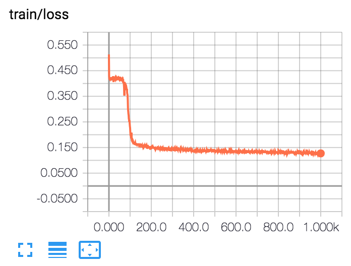
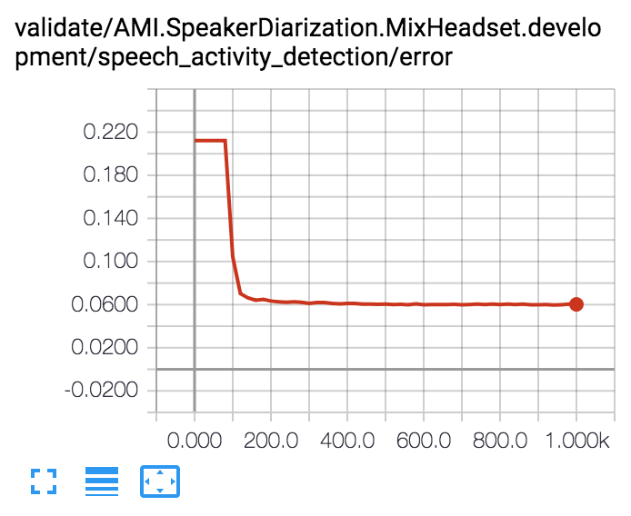

> The MIT License (MIT)
>
> Copyright (c) 2017-2018 CNRS
>
> Permission is hereby granted, free of charge, to any person obtaining a copy
> of this software and associated documentation files (the "Software"), to deal
> in the Software without restriction, including without limitation the rights
> to use, copy, modify, merge, publish, distribute, sublicense, and/or sell
> copies of the Software, and to permit persons to whom the Software is
> furnished to do so, subject to the following conditions:
>
> The above copyright notice and this permission notice shall be included in all
> copies or substantial portions of the Software.
>
> THE SOFTWARE IS PROVIDED "AS IS", WITHOUT WARRANTY OF ANY KIND, EXPRESS OR
> IMPLIED, INCLUDING BUT NOT LIMITED TO THE WARRANTIES OF MERCHANTABILITY,
> FITNESS FOR A PARTICULAR PURPOSE AND NONINFRINGEMENT. IN NO EVENT SHALL THE
> AUTHORS OR COPYRIGHT HOLDERS BE LIABLE FOR ANY CLAIM, DAMAGES OR OTHER
> LIABILITY, WHETHER IN AN ACTION OF CONTRACT, TORT OR OTHERWISE, ARISING FROM,
> OUT OF OR IN CONNECTION WITH THE SOFTWARE OR THE USE OR OTHER DEALINGS IN THE
> SOFTWARE.
>
> AUTHOR  
> Hervé Bredin - http://herve.niderb.fr

# Speech activity detection with `pyannote.audio`

In this tutorial, you will learn how to train, validate, and apply a speech activity detector based on MFCCs and LSTMs, using `pyannote-speech-detection` command line tool.

## Table of contents
- [Citation](#citation)
- [ETAPE database](#etape-database)
- [Configuration](#configuration)
- [Training](#training)
- [Validation](#validation)
- [Application](#application)
- [More options](#more-options)

## Citation
([↑up to table of contents](#table-of-contents))

If you use `pyannote-audio` for speech activity detection, please cite the following paper:

```bibtex
@inproceedings{Yin2017,
  Author = {Ruiqing Yin and Herv\'e Bredin and Claude Barras},
  Title = {{Speaker Change Detection in Broadcast TV using Bidirectional Long Short-Term Memory Networks}},
  Booktitle = {{Interspeech 2017, 18th Annual Conference of the International Speech Communication Association}},
  Year = {2017},
  Month = {August},
  Address = {Stockholm, Sweden},
  Url = {https://github.com/yinruiqing/change_detection}
}
```

## ETAPE database
([↑up to table of contents](#table-of-contents))

```bash
$ source activate pyannote
$ pip install pyannote.db.etape
```

This tutorial relies on the [ETAPE database](http://islrn.org/resources/425-777-374-455-4/). We first need to tell `pyannote` where the audio files are located:

```bash
$ cat ~/.pyannote/db.yml
Etape: /path/to/Etape/corpus/{uri}.wav
```

If you want to train the network using a different database, you might need to create your own [`pyannote.database`](http://github.com/pyannote/pyannote-database) plugin.
See [github.com/pyannote/pyannote-db-template](https://github.com/pyannote/pyannote-db-template) for details on how to do so.

## Configuration
([↑up to table of contents](#table-of-contents))

To ensure reproducibility, `pyannote-speech-detection` relies on a configuration file defining the experimental setup:

```bash
$ cat tutorials/speech-activity-detection/config.yml
```
```yaml
# train the network for speech activity detection
# see pyannote.audio.labeling.tasks for more details
task:
   name: SpeechActivityDetection
   params:
      duration: 3.2

# use precomputed features (from feature extraction tutorials)
feature_extraction:
   name: Precomputed
   params:
      root_dir: /path/to/tutorials/feature-extraction

# use the StackedRNN architecture.
# see pyannote.audio.labeling.models for more details
architecture:
   name: StackedRNN
   params:
     rnn: LSTM
     recurrent: [16]
     bidirectional: True
     linear: [16]
```

## Training
([↑up to table of contents](#table-of-contents))

The following command will train the network using the training set of the `TV` protocol of the ETAPE database for 50 epochs (one epoch = one hour of audio).

```bash
$ export EXPERIMENT_DIR=tutorials/speech-activity-detection
$ pyannote-speech-detection train --to=50 ${EXPERIMENT_DIR} Etape.SpeakerDiarization.TV
```
```
Epoch #0: 100%|█████████████████████████████████████| 36/36 [00:40<00:00,  1.12s/it]
Epoch #1: 100%|█████████████████████████████████████| 36/36 [00:24<00:00,  1.47it/s]
...
Epoch #50: 100%|████████████████████████████████████| 36/36 [00:24<00:00,  1.46it/s]
```

This will create a bunch of files in `TRAIN_DIR` (defined below).
One can follow along the training process using [tensorboard](https://github.com/tensorflow/tensorboard).
```bash
$ tensorboard --logdir=${EXPERIMENT_DIR}
```




## Validation
([↑up to table of contents](#table-of-contents))

To get a quick idea of how the network is doing during training, one can use the `validate` mode.
It can (should!) be run in parallel to training and evaluates the model epoch after epoch.
One can use [tensorboard](https://github.com/tensorflow/tensorboard) to follow the validation process.

```bash
$ export TRAIN_DIR=${EXPERIMENT_DIR}/train/Etape.SpeakerDiarization.TV.train
$ pyannote-speech-detection validate ${TRAIN_DIR} Etape.SpeakerDiarization.TV
```
```
Epoch #20 : DetectionErrorRate = 5.159% [5.159%, #20]: : 21epoch [37:50, 97.52s/epoch]
```



## Application
([↑up to table of contents](#table-of-contents))

Now that we know how the model is doing, we can apply it on all files of the `TV` protocol of the ETAPE database and store raw SAD scores in `/path/to/sad`:

```bash
$ pyannote-speech-detection apply ${TRAIN_DIR}/weights/0050.pt Etape.SpeakerDiarization.TV /path/to/sad
```

We can then use these raw scores to perform actual speech activity detection, and [`pyannote.metrics`](http://pyannote.github.io/pyannote-metrics/) to evaluate the result:


```python
# ETAPE protocol
>>> from pyannote.database import get_protocol
>>> protocol = get_protocol('Etape.SpeakerDiarization.TV')

# precomputed scores
>>> from pyannote.audio.features import Precomputed
>>> precomputed = Precomputed('/path/to/sad')

# scores binarizer
>>> from pyannote.audio.signal import Binarize
# onset / offset are tunable parameters (and should be tuned for better performance)
# we use log_scale = True because of the final log-softmax in the StackedRNN model
>>> binarize = Binarize(onset=0.5, offset=0.5, log_scale=True)

# evaluation metric
>>> from pyannote.metrics.detection import DetectionErrorRate
>>> metric = DetectionErrorRate()

# loop on test files
>>> from pyannote.database import get_annotated
>>> for test_file in protocol.test():
...    # load reference annotation
...    reference = test_file['annotation']
...    uem = get_annotated(test_file)
...
...    # load precomputed SAD scores as pyannote.core.SlidingWindowFeature
...    sad_scores = precomputed(test_file)
...
...    # binarize scores to obtain speech regions as pyannote.core.Timeline
...    speech_regions = binarize.apply(sad_scores, dimension=1)
...
...    # evaluate speech activity detection
...    metric(reference, speech_regions.to_annotation(), uem=uem)

>>> print(f'Detection error rate = {100*abs(metric):.1f}%')
Detection error rate = 6.3%
```
## More options

For more options, including training on GPU, see:

```bash
$ pyannote-speech-detection --help
```

That's all folks!
